# UCMS: University Course Management System

**A full-stack platform for running a university's academic and financial operations:
course catalogue, class scheduling, enrollment, attendance, grading, billing and analytics.
It has four role-based portals and a database layer that enforces its own business rules.**


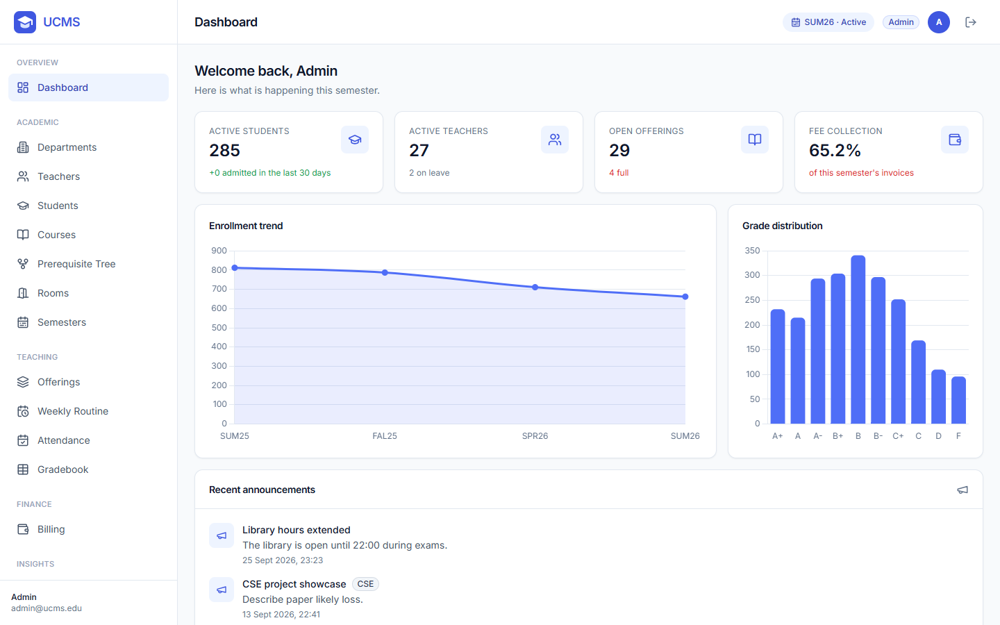

---

## Contents
- [Overview](#overview)
- [Key features](#key-features)
- [Screenshots](#screenshots)
- [Architecture](#architecture)
- [Database design](#database-design)
- [Getting started](#getting-started)
- [Testing](#testing)
- [API overview](#api-overview)
- [Roles and permissions](#roles-and-permissions)
- [Configuration](#configuration)
- [Project structure](#project-structure)
- [Author](#author)
- [License](#license)

---

## Overview

UCMS covers the full lifecycle of a semester in one application: admins set up departments,
courses, rooms and offerings; students register for courses; teachers take attendance and
publish grades; and accountants bill and collect fees.

The core design choice is that **data integrity lives in the database, not only in the
application code.** Over-full classes, double-booked rooms, marks above the maximum, over-paid
invoices and a second active semester are rejected by SQLite itself, through constraints,
triggers and partial unique indexes. Every change to enrollments and payments is written to an
audit trail by the database. The rules still hold for writes that bypass the API.

| Layer | Technology |
|---|---|
| Database | SQLite 3 in WAL mode, through Python's `sqlite3` driver. Hand-written, parameterized SQL with no ORM. |
| Backend | Python 3.11, FastAPI, Uvicorn, Pydantic v2, JWT authentication (python-jose), bcrypt password hashing |
| Frontend | HTML, vanilla JavaScript, Tailwind CSS, Chart.js, Lucide icons. No build step. |
| Quality | 316 automated tests (pytest + FastAPI TestClient), including multi-threaded race-condition tests |

**At a glance:** 21 normalized tables · 34 triggers · 5 views · 26 indexes · 70 REST endpoints ·
18 responsive pages · 4 user roles · about 89,000 rows of realistic demo data.

---

## Key features

### For each role
- **Admin:** manage departments, teachers, students (a 2-step onboarding form), courses with
  prerequisite chains, rooms and semesters; schedule offerings with automatic clash detection;
  close a semester in one atomic operation; browse the full audit trail.
- **Teacher:** weekly timetable, bulk attendance entry, a gradebook with live weighted totals,
  one-click grade finalization, and class analytics (grade distribution, low-attendance alerts).
- **Student:** self-service enrollment where every unavailable course shows *why* (full,
  prerequisite missing, credit limit…), plus a transcript with semester GPA and CGPA,
  attendance summary and outstanding dues.
- **Accountant:** fee structures with department-level overrides, invoice generation for a single
  student or a whole semester, payment recording (cash, bank, bKash, Nagad, card) and collection
  reports.

---

## Screenshots

| | |
|---|---|
| **Student: enrollment**. Every rule is checked by the server, and disabled buttons show the reason. 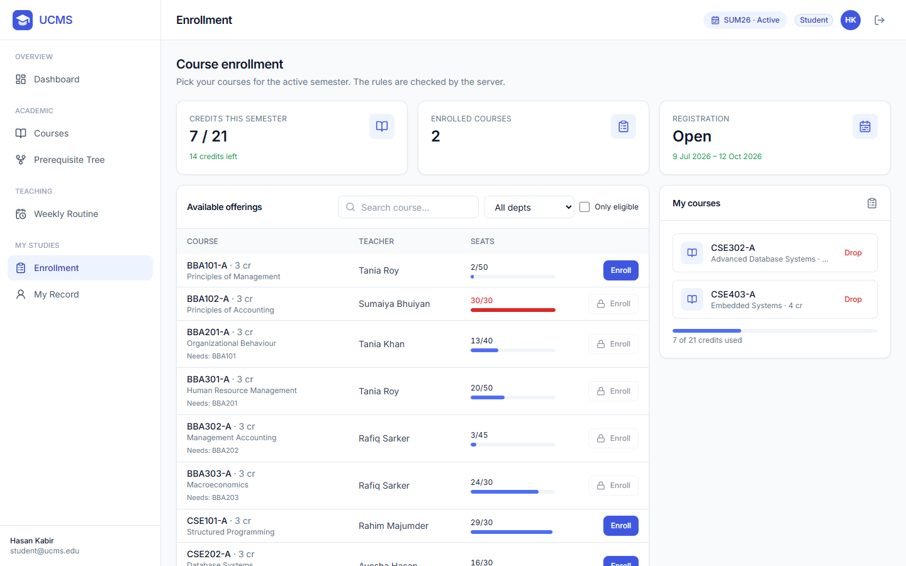 | **Teacher: gradebook**. Editable marks with a live weighted total. 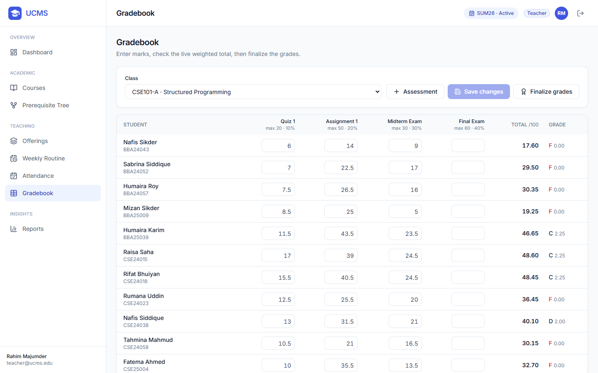 |
| **Prerequisite tree**, built from one recursive query. 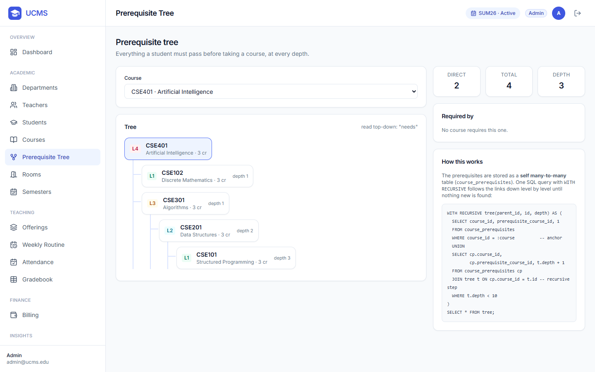 | **Audit log**, written automatically by database triggers. 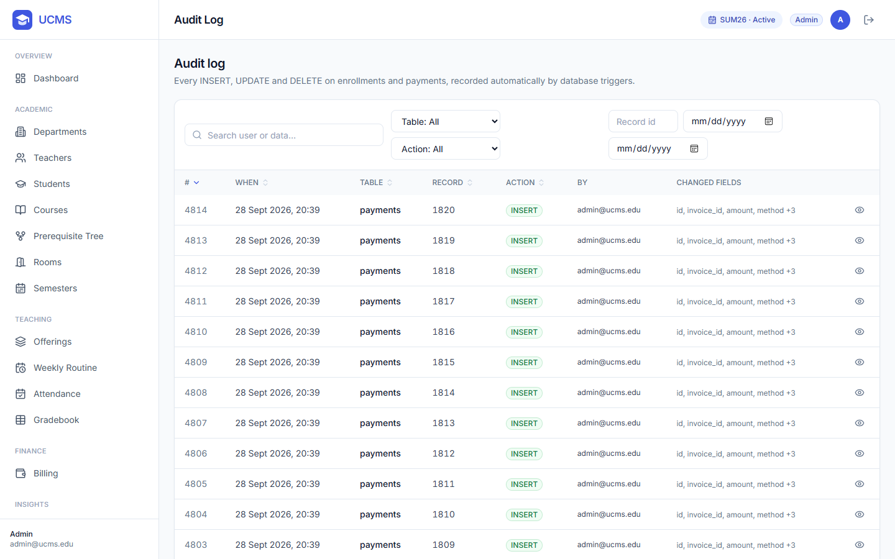 |
| **Offerings**: seat fill and schedules. 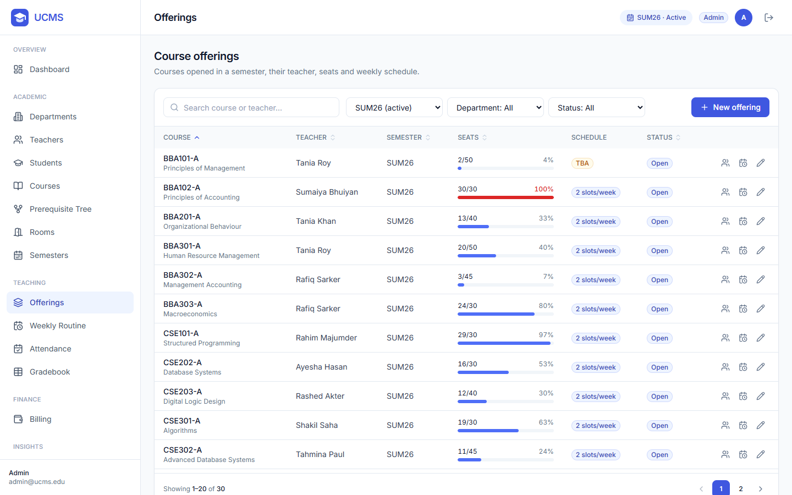 | **Weekly routine**. 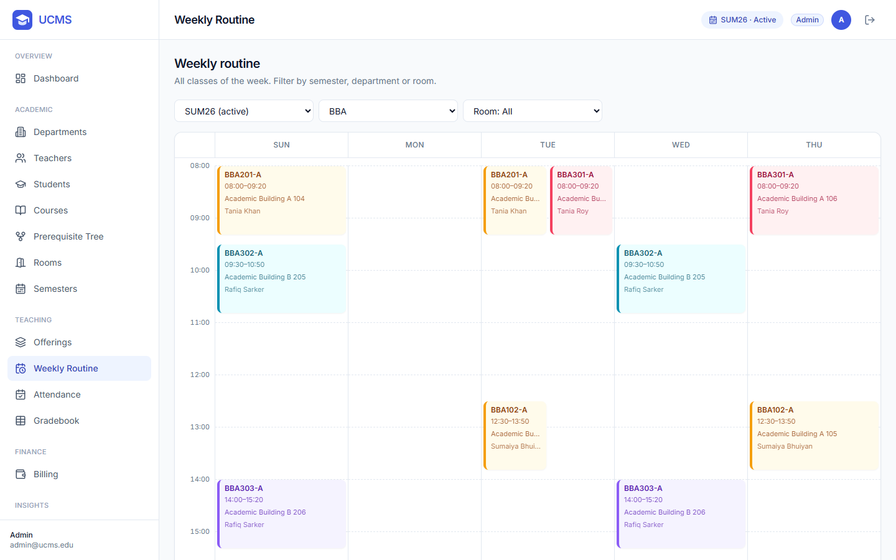 |
| **Teacher: attendance**. Bulk save in a single transaction. 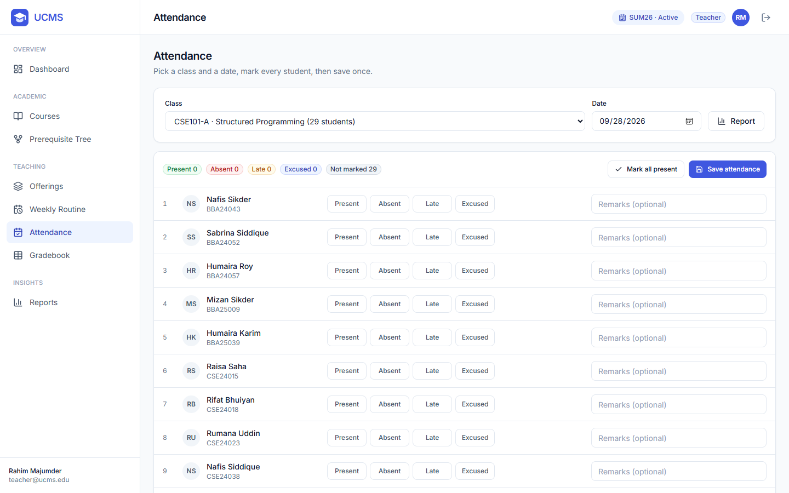 | **Accountant: billing**. 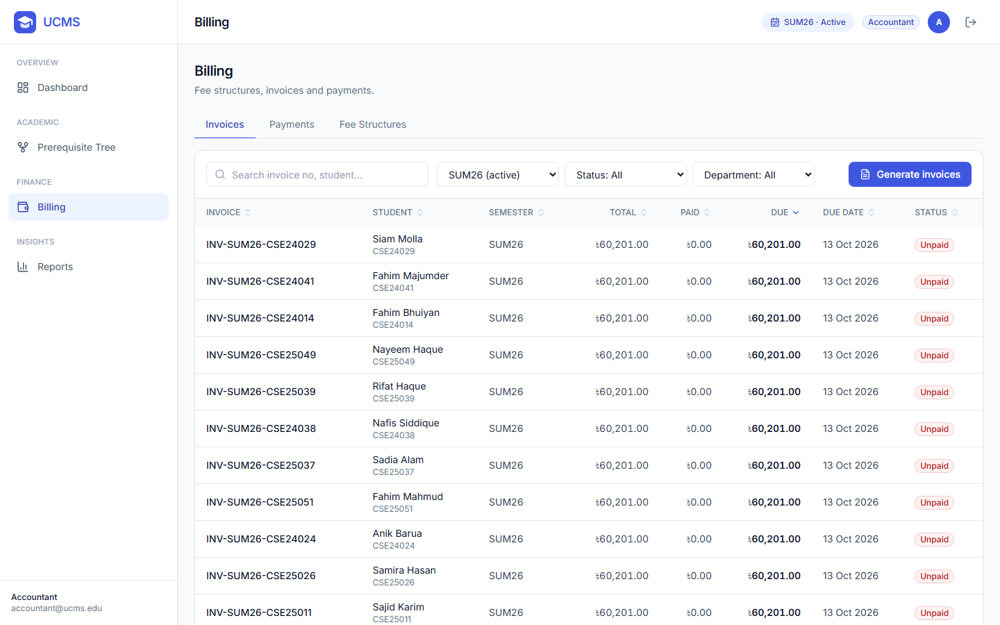 |
| **Reports and analytics**. 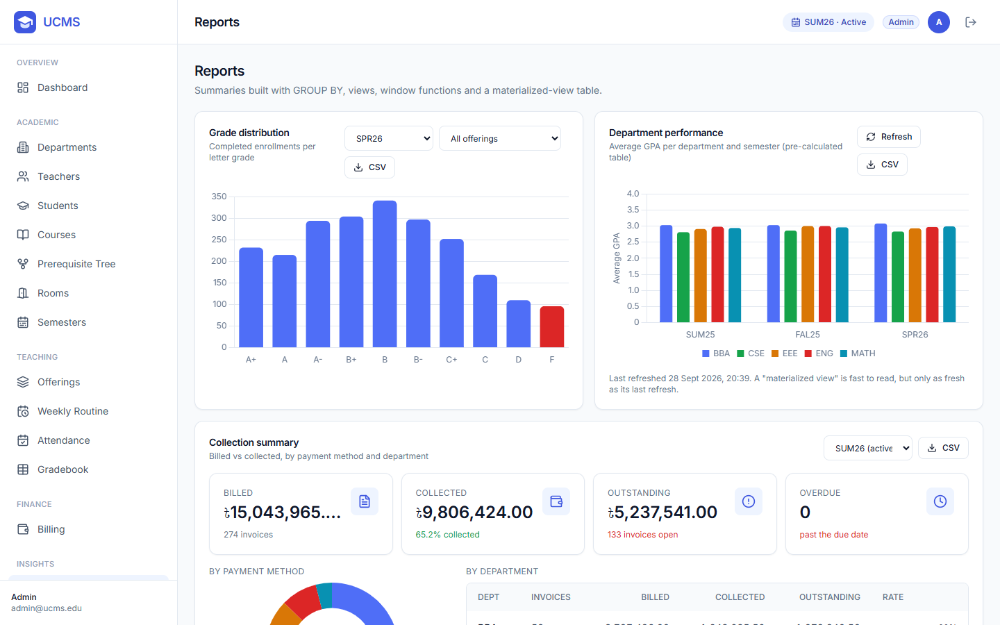 | **Mobile (375 px)**. 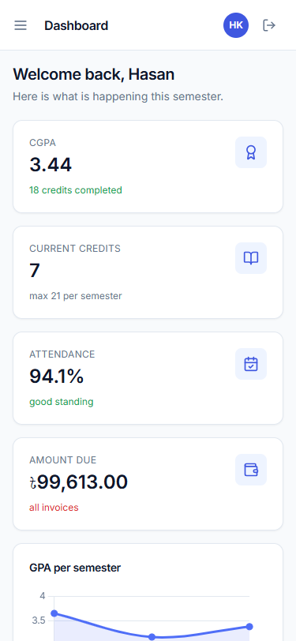 |

---

## Database design

21 normalized core tables, plus two supporting tables: an audit-actor table and the materialized
department-performance view. The only stored derived values (`enrolled_count`, `paid_amount`) are
deliberate, for fast reads. Triggers keep them exact.

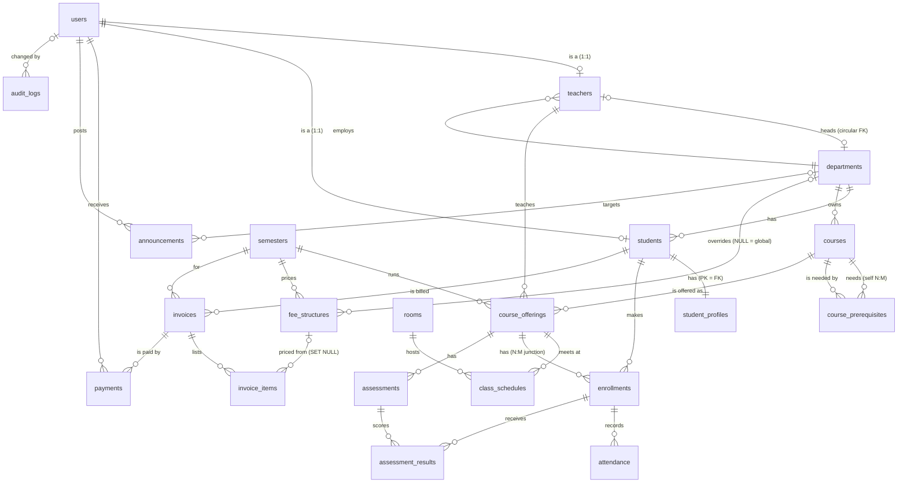

| Relationship | Example | Implementation |
|---|---|---|
| One-to-one | user ↔ teacher, user ↔ student | `UNIQUE` foreign key |
| Strict one-to-one | student ↔ profile | primary key doubles as foreign key, `ON DELETE CASCADE` |
| One-to-many | department → courses, invoice → payments | foreign key on the "many" side |
| Many-to-many with attributes | students ↔ offerings | `enrollments` junction (status, marks, grade) |
| Self-referencing many-to-many | course ↔ prerequisite course | `course_prerequisites`, self-reference blocked by `CHECK` |
| Circular | department ↔ head teacher | added with SQLite's table-rebuild procedure, `ON DELETE SET NULL` |

---

## Getting started

**Requirement:** Python 3.11 or newer. SQLite ships with Python.

```bash
git clone https://github.com/Md-Emon-Hasan/ucms.git
cd ucms
python -m venv .venv
.venv\Scripts\activate              # Windows
# source .venv/bin/activate         # macOS / Linux
pip install -r requirements.txt
copy .env.example .env              # macOS / Linux: cp .env.example .env

python run.py
```

Open **http://localhost:8000**. The interactive API documentation (Swagger UI) is at
**http://localhost:8000/docs**.

On first start the database is created and filled with deterministic demo data: 300 students,
30 teachers, 60 courses, 4 semesters, about 3,000 enrollments, 62,000 attendance records and
1,800 payments. To rebuild it at any time, run `python scripts/seed.py --reset`.

### Demo accounts
All passwords: **`Password123!`**

| Role | Email |
|---|---|
| Admin | `admin@ucms.edu` |
| Teacher | `teacher@ucms.edu` |
| Student | `student@ucms.edu` |
| Accountant | `accountant@ucms.edu` |

---

## Testing

```bash
pytest -q
```

**316 tests, all passing** (about 45 seconds). Each test runs against its own fresh database
file, so the suite is isolated and can run in any order.

| Suite | Tests | Coverage |
|---|---|---|
| `test_constraints.py` | 94 | Every CHECK, UNIQUE and foreign-key rule rejects invalid data; cascade, restrict and set-null behaviour; valid edge cases are still accepted |
| `test_triggers.py` | 29 | Timestamps, seat counters, marks validation, invoice recomputation, audit entries with the correct actor, schedule clashes |
| `test_services.py` | 55 | All 10 business services, including each of the 7 enrollment rejection reasons; a rejected operation leaves the database byte-for-byte unchanged |
| `test_api.py` | 129 | A permission matrix for **every** endpoint (401 / 403 / allowed), record-ownership rules, authentication, end-to-end flows, error formats, SQL-injection-safe sorting, smoke tests on the full demo data |
| `test_concurrency.py` | 9 | Parallel threads racing for the last seat: exactly one wins, every time; locking and isolation behaviour |

The frontend was also verified in a headless browser: all 18 pages for every role, at desktop
and mobile widths, with no script errors or layout overflow, plus 20 end-to-end user flows.

---

## API overview

All endpoints are under `/api` and documented in Swagger UI at `/docs`.

- **Lists:** `?page=1&limit=20&search=&sort=&order=asc` returns
  `{"items": [...], "total": 57, "page": 1, "limit": 20, "pages": 3}`.
- **Errors:** always `{"detail": "message", "errors": {"field": "message"}}`, with status 400 /
  401 / 403 / 404 / 409 / 422.
- **Money:** sent in taka (`1500.50`), returned as integer paisa (`150050`) plus a decimal string
  (`"amount_taka": "1500.50"`).

| Area | Endpoints |
|---|---|
| Auth | `POST /auth/login`, `GET /auth/me` |
| Dashboard | `GET /dashboard/stats` (role-specific) |
| People | departments, teachers, students: list / create / get / update · `GET /teachers/{id}/workload` · `GET /students/{id}/transcript`, `/dues`, `/attendance` |
| Catalogue | courses: list / create / get / update · `POST /courses/{id}/prerequisites` (cycle-checked) · `GET /courses/{id}/prerequisite-tree` |
| Rooms and semesters | list / create / get / update · `GET /semesters/active` · `PATCH /semesters/{id}/activate` · `POST /semesters/{id}/close` |
| Offerings and schedules | list / create / get / update · `GET /offerings/{id}/roster` · `POST /offerings/{id}/schedules` · `DELETE /schedules/{id}` · `GET /schedules/weekly` |
| Enrollment | `POST /enrollments` · `GET /enrollments` · `GET /enrollments/eligibility` · `PATCH /enrollments/{id}/drop` · `POST /enrollments/{id}/finalize-grade` |
| Attendance and assessments | `POST`/`GET /offerings/{id}/attendance` · `GET /offerings/{id}/attendance-report` · `POST /assessments` · `POST /assessments/{id}/results` · `GET /offerings/{id}/gradebook` |
| Billing | `GET`/`POST /fee-structures` · `POST /invoices/generate` · `GET /invoices`, `/invoices/{id}` · `GET`/`POST /payments` |
| Communication and audit | `GET`/`POST /announcements` · `GET /audit-logs` |
| Reports | `GET /reports/grade-distribution`, `/department-performance` (+ refresh), `/collection-summary`, `/low-attendance` |

---

## Roles and permissions

| Capability | Admin | Teacher | Student | Accountant |
|---|:-:|:-:|:-:|:-:|
| Manage departments, people, courses, rooms, semesters, offerings | ✔ | | | |
| View timetable, course catalogue, prerequisite tree | ✔ | ✔ | ✔ | ✔ |
| Attendance, marks, grade finalization | ✔ | own classes | | |
| Enroll and drop | ✔ | | self only | |
| Transcript, dues, attendance record | ✔ | | self only | |
| Fee structures, invoices, payments | ✔ | | own invoices (read) | ✔ |
| Reports | ✔ | own classes | | collections |
| Audit log | ✔ | | | |

Access is enforced twice: a **role check** on every endpoint and an **ownership check** on
individual records. So a student gets `403 Forbidden` when asking for another student's
transcript, even though both have the student role.

---

## Configuration

Settings are read from environment variables or from a `.env` file (see `.env.example`).

| Variable | Default | Description |
|---|---|---|
| `UCMS_DB_PATH` | `ucms.db` | Database file location |
| `JWT_SECRET` | `dev-secret-change-me` | Token signing key. Set a long random value in production. |
| `JWT_EXPIRE_HOURS` | `8` | Session length |
| `HOST` / `PORT` | `127.0.0.1` / `8000` | Server address |

---

## Project structure

```
ucms/
├── run.py                 one-command start: prepares the database, then runs the server
├── requirements.txt       pinned dependencies
├── sql/                   schema: tables, circular-FK rebuild, indexes, views, triggers, materialized view
├── scripts/               init, reset, seed, backup and query-runner utilities
├── queries/               40 analytical SQL queries (CTEs, window functions, reports)
├── app/
│   ├── main.py            FastAPI application
│   ├── database.py        connections, PRAGMAs, transaction management
│   ├── security.py        bcrypt, JWT, role and ownership checks
│   ├── errors.py          uniform error responses
│   ├── pagination.py      shared paging / search / sorting
│   ├── schemas/           Pydantic request models
│   ├── repositories/      data access (SQL)
│   ├── services/          business logic
│   └── routers/           17 routers, 70 endpoints
├── frontend/              18 pages, shared JS component library, styles
├── tests/                 fixtures, data factory and 5 test suites
└── docs/screenshots/      README images
```

---

## Author

**Md Emon Hasan**

- Email: [emon.mlengineer@gmail.com](mailto:emon.mlengineer@gmail.com)
- Portfolio: [Md-Emon-Hasan](https://emonlabs-ai.hitechparks.com/)
- LinkedIn: [md-emon-hasan](https://www.linkedin.com/in/md-emon-hasan-695483237/)
- GitHub: [Md-Emon-Hasan](https://github.com/Md-Emon-Hasan)
- Facebook: [Md-Emon-Hasan](https://www.facebook.com/mdemon.hasan2001/)
- WhatsApp: [+8801834363533](https://wa.me/8801834363533)

---

## License

MIT License - see [LICENSE](LICENSE) file for details.

---
